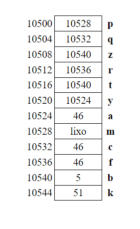

## Respostas slide 26 (Lista 06)

**QUESTÃO 1:** O endereço de memória da variavel num.

**QUESTÃO 2:** e.

**QUESTÃO 3:** 
a) ```int *py;``` 
b) ```char *pch;``` 
c) ```float *z;```

**QUESTÃO 4:** a

**QUESTÃO 5:** c

**QUESTÃO 6:** a, f, i, k.

**QUESTÃO 7:** 



**QUESTÃO 8:** v, v, f, v, v, f, v

**QUESTÃO 9:** Saída: 14

**QUESTÃO 10:** 
"valor de k: 2",
"valor de m: 6",
"valor de c: 0",
"valor de d: 3.5".

